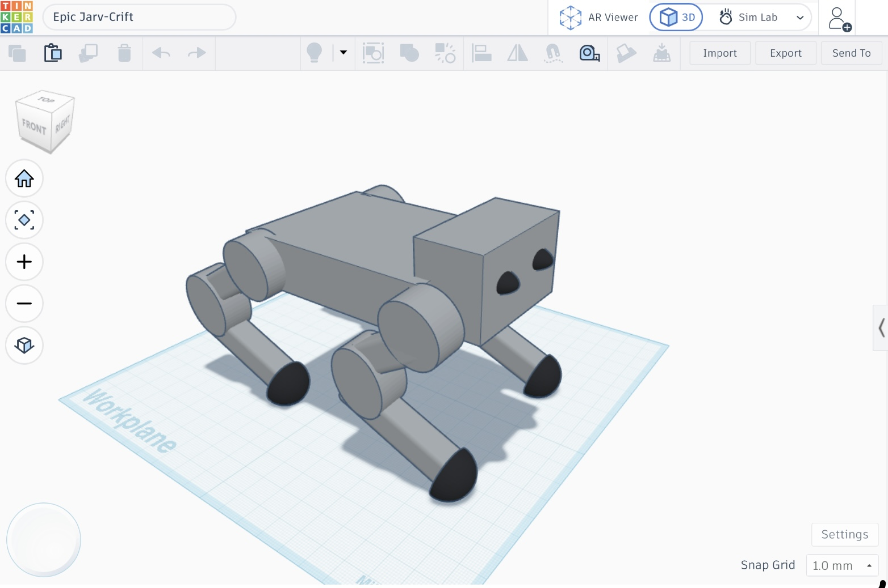
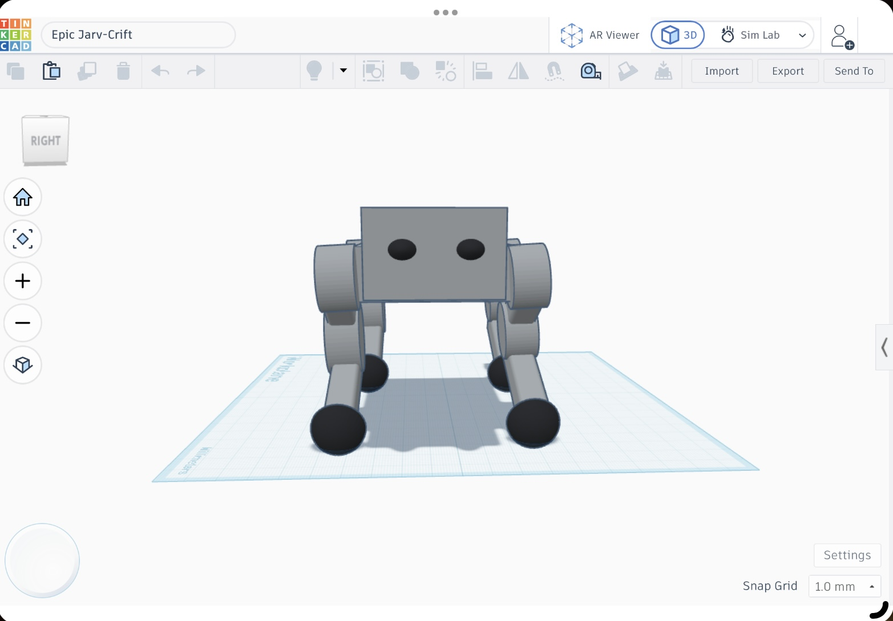
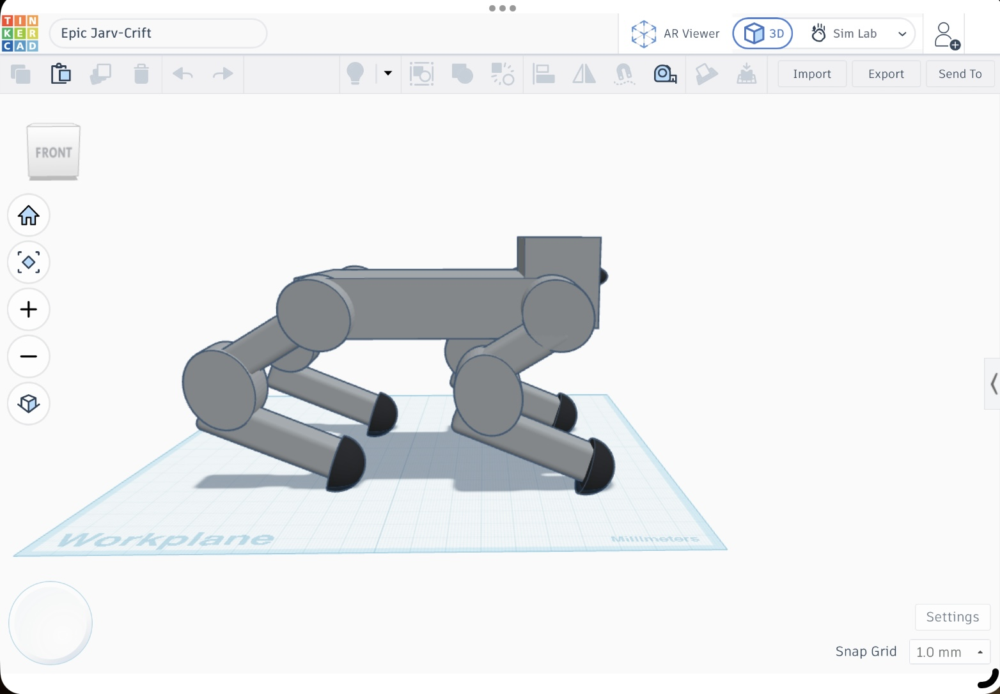

# Simple Quadruped Robot Dog

## Overview

This project presents the preliminary mechanical design of a simple quadruped robot dog. The objective is to understand the basic mechanical principles required for a robot to stand and walk rather than building an advanced robotic system.

---

## Robot Design

*Figure 1: Isometric View of the Robot.*

---

## Body Structure

The robot has a simple rectangular body made to support all mechanical parts. The chassis is lightweight and provides good balance.

---

## Leg Design

The robot has four identical legs. Each leg consists of:
- Upper leg
- Lower leg
- Hip joint
- Knee joint

This simple design helps the robot stand and walk.

*Figure 2: Front View.*

---

## Joints and Degrees of Freedom (DOF)

Each leg has:
- 1 Hip Joint
- 1 Knee Joint

Total DOF:
- 2 DOF per leg
- 8 DOF for the whole robot

---

## Motor Selection

The robot uses **MG996R Servo Motors** because they:
- Provide good torque
- Are easy to control
- Are suitable for small robots.

---

## Preliminary Torque Calculation

Assume:
- Weight on one leg = 0.5 kg
- Leg length = 0.1 m

**Formula:**

Torque = Force × Distance

**Result:**

Required torque ≈ **0.5–1.0 N·m**

---

## Stability and Center of Gravity

The center of gravity is placed near the middle of the body. The four legs are evenly spaced to improve stability while standing and walking.

---

## Proposed Walking Method

The robot uses a **Crawl Gait**, where one leg moves at a time. This method provides good stability and is easy to implement.

---

## Expected Mechanical Problems

Possible problems include:
- Joint friction
- Servo overload
- Leg misalignment
- Balance issues

---

## Conclusion

This design focuses on the basic mechanical principles of a quadruped robot. The goal is to understand how the robot can stand and walk using a simple mechanical design rather than building an advanced robot.

---

## Side View

*Figure 3: Side View.*
